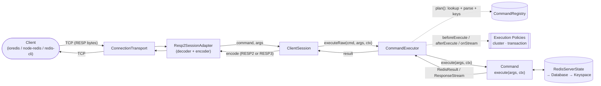
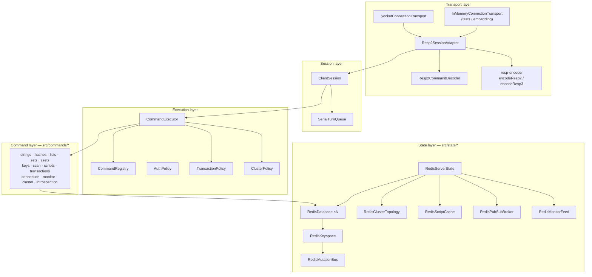
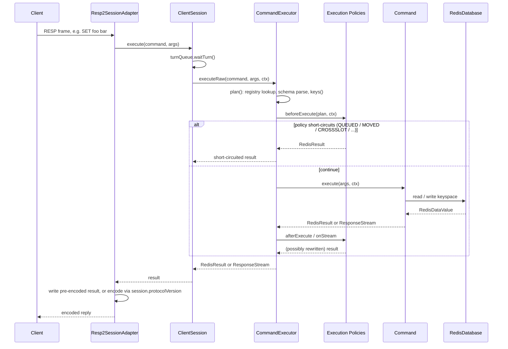
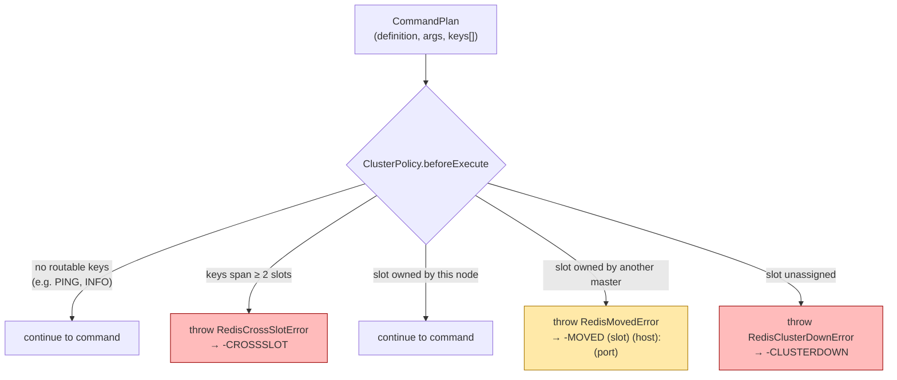
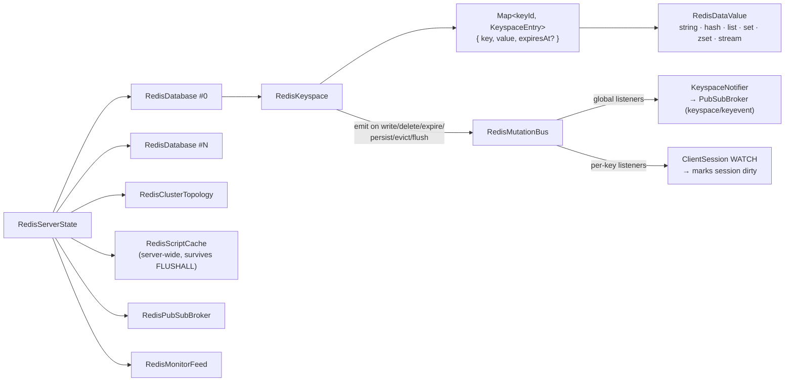

# Architecture

`js-redis-server` is a small **Redis protocol interpreter** wrapped in
pluggable layers — transport, session, execution (with composable policies),
commands, and state. The same executor pipeline drives standalone mode,
cluster mode, `MULTI`/`EXEC` transactions, and Lua `EVAL` alike, so routing,
queueing, and command semantics never diverge between them.

## Contents

- [Request lifecycle](#request-lifecycle)
- [Layers](#layers)
- [Command execution pipeline](#command-execution-pipeline)
- [Execution policies](#execution-policies)
  - [Transactions — MULTI / EXEC / WATCH](#transactions--multi--exec--watch)
  - [Cluster routing](#cluster-routing)
- [State & data model](#state--data-model)
- [Concurrency model](#concurrency-model)
- [Protocol & transports (RESP2 / RESP3)](#protocol--transports-resp2--resp3)
- [Cluster mode](#cluster-mode)
- [Lua scripting](#lua-scripting)
- [Adding a command](#adding-a-command)

## Request lifecycle



A frame arrives as raw bytes on a [`ConnectionTransport`](../src/core/transports/connection-transport.ts),
gets decoded into `(command, args)` by the
[`Resp2CommandDecoder`](../src/core/transports/resp2/decoder.ts), and is handed
to the connection's [`ClientSession`](../src/core/client-session.ts). The
session asks the [`CommandExecutor`](../src/core/command-executor.ts) to look
up and run it; the executor returns a `RedisResult` (or a `ResponseStream` for
streaming replies), which the session adapter encodes back to wire bytes using
the protocol version (`RESP2`/`RESP3`) negotiated for that connection. A
`RedisResult` can also carry pre-encoded bytes for protocol-sensitive composite
replies such as `EXEC` crossing an in-transaction `HELLO`. While executing a
valid command plan, the `CommandExecutor` publishes a cloned command event to the
server-level monitor feed when `MONITOR` clients are listening.
Unknown commands and arity/syntax failures are skipped; execution errors from
successfully planned commands are still published, matching Redis. Cluster
redirects and pre-execution cluster errors are skipped because the command is not
executed on that node. Commands with monitor skip metadata are skipped, sensitive
authentication arguments are redacted, transaction commands are emitted when
`EXEC` replays them, and Lua `redis.call` / `redis.pcall` commands are emitted
with the `lua` source. Credential-bearing commands declare their own monitor
redaction metadata in the command definition, and Redis-invisible commands
declare monitor skip metadata there too, so the executor does not need
command-specific argument knowledge.

## Layers



| Layer         | Responsibility                                                                                                     | Key types                                                                                                                                                                                                                                                                                                                          |
| :------------ | :----------------------------------------------------------------------------------------------------------------- | :--------------------------------------------------------------------------------------------------------------------------------------------------------------------------------------------------------------------------------------------------------------------------------------------------------------------------------- |
| **Transport** | Frames bytes on/off the wire; decouples the core from `net.Socket`                                                 | [`ConnectionTransport`](../src/core/transports/connection-transport.ts), [`SocketConnectionTransport`](../src/core/transports/socket-connection-transport.ts), [`InMemoryConnectionTransport`](../src/core/transports/in-memory-connection-transport.ts), [`Resp2SessionAdapter`](../src/core/transports/resp2/session-adapter.ts) |
| **Session**   | Per-connection state: selected DB, RESP version, transaction queue, `WATCH`ed keys, abort signal, turn acquisition | [`ClientSession`](../src/core/client-session.ts)                                                                                                                                                                                                                                                                                   |
| **Execution** | Looks up commands, parses args, extracts keys, and runs composable policies around `execute`                       | [`CommandExecutor`](../src/core/command-executor.ts), [`CommandRegistry`](../src/core/command-registry.ts), [`ExecutionPolicy`](../src/core/execution-policies/index.ts)                                                                                                                                                           |
| **Command**   | Pure `(args, ctx) → RedisResult \| ResponseStream` implementations grouped by data type                            | [`src/commands/`](../src/commands/)                                                                                                                                                                                                                                                                                                |
| **State**     | In-memory keyspace, mutation events, cluster topology, script cache, connected clients, pub/sub, monitor feed      | [`RedisServerState`](../src/state/server-state.ts), [`RedisDatabase`](../src/state/database.ts), [`RedisKeyspace`](../src/state/keyspace.ts)                                                                                                                                                                                       |

Commands never touch the transport — they return a `RedisResult` (or a
`ResponseStream` for push-style replies) and let the executor/session/adapter
chain handle delivery. That is what lets the _exact same_ command run
standalone, inside a cluster node, inside `MULTI`/`EXEC`, and inside a Lua
script without rewrites.

## Command execution pipeline



[`CommandExecutor.plan()`](../src/core/command-executor.ts#L34) resolves a
`CommandDefinition` from the registry, parses raw `Buffer` args through the
command's [schema](../src/core/command-schema.ts) (single source of truth for
arity/syntax), and extracts routing keys via `definition.keys(args)` — the
result is a `CommandPlan` that policies and the executor share.

Two execution paths share this same plan:

- [`executePlan`](../src/core/command-executor.ts#L65) — the normal async path
  used for client-issued commands and `MULTI`/`EXEC` playback. Supports
  streaming results (`ResponseStream`) and `afterExecute`/`onStream` rewriting.
- [`executePlanSync`](../src/core/command-executor.ts#L116) — a synchronous path
  used exclusively by the Lua runtime for `redis.call`/`redis.pcall`. It runs
  the **same** policies and registry, and rejects any command or policy hook
  that tries to go async or stream — so a script can never bypass cluster
  routing or transaction rules.

## Execution policies

An [`ExecutionPolicy`](../src/core/execution-policies/index.ts#L9) wraps every
command with three optional hooks:

```ts
beforeExecute(plan, ctx) // can short-circuit with a RedisResult (queue, redirect, reject)
afterExecute(plan, ctx, result) // can rewrite the result
onStream(plan, ctx, stream) // can wrap/replace a streaming result
```

[`createRedisCommandExecutor`](../src/commands/index.ts#L41) always prepends
[`AuthPolicy`](../src/core/execution-policies/auth-policy.ts) first and appends
[`TransactionPolicy`](../src/core/execution-policies/transaction-policy.ts)
last; [`ClusterPolicy`](../src/core/execution-policies/cluster-policy.ts) is
inserted between them only for cluster nodes (see [`buildRedisCluster`](../src/cluster.ts#L70)).
Order matters: `AuthPolicy` rejects unauthenticated clients with `NOAUTH`
before any routing or queueing happens (only `AUTH`/`HELLO`/`RESET`/`QUIT` pass
when `requirepass` is set and the session is unauthenticated), and cluster
routing must validate (and possibly redirect/reject) **before** a command is
queued into a transaction — exactly like real Redis Cluster validates
`CROSSSLOT` at queue time.

### Transactions — MULTI / EXEC / WATCH

```mermaid
sequenceDiagram
    participant Cl as Client
    participant CS as ClientSession
    participant TP as TransactionPolicy
    participant CE as CommandExecutor

    Cl->>CS: MULTI
    CS->>CS: beginTransaction() → mode = "transaction"
    CS-->>Cl: +OK

    Cl->>CS: SET a 1
    CS->>CE: executeRaw(SET, [a, 1], ctx)
    CE->>TP: beforeExecute
    TP->>CS: queueTransaction(plan)
    TP-->>CE: +QUEUED
    CE-->>Cl: +QUEUED

    Cl->>CS: EXEC
    CS->>CE: executeRaw(EXEC, [], ctx)
    Note over CE,CS: queue dirty (e.g. unknown cmd) → discard, EXECABORT<br/>(takes precedence over WATCH)<br/>else WATCH dirty → discard, reply *-1<br/>EXEC itself malformed (e.g. `EXEC foo`) → discard immediately,<br/>EXECABORT "Transaction discarded because of: &lt;reason&gt;"
    CE->>CS: drainTransaction() → plans[]
    CS->>CS: executeTransaction(plans)<br/>runs each plan through the executor, in order
    CS-->>Cl: array of per-command replies
```

While a session is in `'transaction'` mode,
[`TransactionPolicy`](../src/core/execution-policies/transaction-policy.ts)
intercepts every non-control command in `beforeExecute`, queues its
already-parsed `CommandPlan` on the session, and replies `+QUEUED` — so parsing
and key-extraction (and therefore early `CROSSSLOT`/`MOVED` errors) happen at
queue time, not at `EXEC` time. `EXEC` drains the queue and replays each plan
through [`ClientSession.executeTransaction`](../src/core/client-session.ts#L156),
which reuses the normal `executePlan` path per command. When a queued `HELLO`
changes the session RESP version, `executeTransaction` captures each element's
wire bytes with the protocol version active after that element runs, then returns
a pre-encoded outer array so earlier replies are not retroactively re-encoded.

`WATCH` subscribes to per-key mutation events on the database
([`ClientSession.watch`](../src/core/client-session.ts#L185)); any write,
delete, or lazy-eviction on a watched key marks the session dirty. Before
running the queue `EXEC` checks `isTransactionDirty()` first — a bad queued
command aborts with `EXECABORT` regardless of WATCH state — then
`isWatchDirty()`, which replies `*-1` only when the queue is otherwise clean
(matching real Redis `CLIENT_DIRTY_EXEC` over `CLIENT_DIRTY_CAS` precedence;
see [State & data model](#state--data-model) for how mutation events propagate).

### Cluster routing



[`ClusterPolicy`](../src/core/execution-policies/cluster-policy.ts#L16) computes
a slot for the plan's keys via
[`RedisClusterTopology.calculateSlotForKeys`](../src/state/cluster-topology.ts#L25)
and either lets the command through, redirects with `MOVED`, or rejects with
`CROSSSLOT`/`CLUSTERDOWN`. Replicas never "own" a slot for routing purposes —
a keyed command sent directly to a replica is redirected to its master. Inside
a transaction, the slot of the _first_ keyed command is pinned per-session in a
`WeakMap` so every subsequent queued command must hash to the same slot.

## State & data model



[`RedisServerState`](../src/state/server-state.ts#L13) owns one or more
[`RedisDatabase`](../src/state/database.ts#L28) instances plus the state that
is server-wide rather than per-DB: the cluster topology, the Lua
[`RedisScriptCache`](../src/state/script-cache.ts) (so `FLUSHALL`/`FLUSHDB`
clear keyspace data but **not** cached scripts — only `SCRIPT FLUSH` does),
a registry of connected client sessions for `CLIENT LIST`, and the
[`RedisPubSubBroker`](../src/state/pubsub-broker.ts) used by client Pub/Sub
commands for channel and pattern fan-out within that server state, plus the
[`RedisMonitorFeed`](../src/state/monitor-feed.ts) used by `MONITOR` to fan out
cloned command events without any command writing directly to a transport.

Each database wraps a [`RedisKeyspace`](../src/state/keyspace.ts#L34): a
`Map<keyId, KeyspaceEntry>` holding byte-safe `Buffer` keys and typed
[`RedisDataValue`](../src/state/data-types.ts)s (`string`, `hash`, `list`,
`set`, `zset`, `stream`). Stream values store ordered entries plus consumer
groups, per-group pending-entry lists, and consumer idle metadata. Expiration is
handled by both an active sweep and a lazy fallback. `RedisServerState` runs a
background active-expiry pass across its databases, under each database's
`SerialTurnQueue`; cluster replicas disable their own active sweep and rely on
the master's replicated deletion. `getLiveEntry` still calls
[`evictIfExpired`](../src/state/keyspace.ts#L240) on reads that encounter an
expired key before the next sweep. Either path deletes the entry and emits an
`evict` mutation event so `WATCH` observes expiry exactly like a real delete.
Every mutation (`write`/`delete`/`expire`/`persist`/`evict`/`flush`)
flows through [`RedisMutationBus.emit`](../src/state/mutation-events.ts#L68),
which clones values before fan-out so subscribers can never mutate shared state.
The [`KeyspaceNotifier`](../src/state/keyspace-notifier.ts) subscribes to this
bus and republishes mutations as Redis keyspace/keyevent notifications through
the `RedisPubSubBroker` when `notify-keyspace-events` is enabled. Lifecycle
events (`del`/`expire`/`persist`/`expired`) come straight from the mutation
type; write event names (`set`/`lpush`/…) come from the active command, which
the `CommandExecutor` records on the `RedisDatabase` around `execute`.
In-place collection updates run through a keyspace-owned mutation tracker and
typed helpers such as `TrackedHashData.setField()` and
`TrackedListData.trim()`. Dirty tracking is operation-based rather than a
before/after value diff: effective helper operations mark the key dirty as they
run, even if a later operation restores the same final value. Commands use an
explicit force-write escape hatch for Redis-compatible semantics where a
successful write dirties `WATCH` even when no helper operation changed the final
value, such as identical STORE rewrites or `LTRIM key 0 -1`.

## Concurrency model

Each `RedisDatabase` owns a [`SerialTurnQueue`](../src/core/turn-queue.ts#L12).
Every `session.execute()` call waits for a turn before reaching the executor
and releases it in a `finally` block — so, within one database, commands run to
completion one at a time, mirroring single-threaded Redis semantics. (Sessions
on _different_ databases run independently; the mock intentionally allows
cross-database parallelism that real Redis does not have — don't rely on
cross-DB ordering in tests.)

The turn handle also exposes `suspend(waitFor)`, and `RedisExecutionContext`
carries a `park` handler
([`createDefaultParkHandler`](../src/core/redis-context.ts#L47)): a command can
release its turn while waiting on something, then re-acquire one with priority
once it resolves — without deadlocking the queue. This is the plumbing the
[refactor](../src/core/redis-context.ts) was designed around for blocking
commands. `BLPOP`, `BRPOP`, `BLMOVE`, `BLMPOP`, and `XREAD BLOCK` use this
contract without special session or queue code.

## Protocol & transports (RESP2 / RESP3)

[`ConnectionTransport`](../src/core/transports/connection-transport.ts) is a
minimal duplex-byte-stream interface (`read`/`write`/`close`/`signal`/`on`)
with two implementations: [`SocketConnectionTransport`](../src/core/transports/socket-connection-transport.ts)
for real TCP connections, and [`InMemoryConnectionTransport`](../src/core/transports/in-memory-connection-transport.ts)
for tests and programmatic embedding (feed bytes in, inspect bytes out — no
socket required). [`Resp2Server`](../src/core/transports/resp2/server.ts)
wires a transport to a fresh `ClientSession` per connection through a
[`Resp2SessionAdapter`](../src/core/transports/resp2/session-adapter.ts), which
owns a [`Resp2CommandDecoder`](../src/core/transports/resp2/decoder.ts)
(handles both RESP multibulk arrays and inline commands, including quoted/escaped
inline arguments) for the request side.

On the reply side, [`encodeRedisValue`](../src/core/resp-encoder.ts#L17)
serializes the protocol-agnostic [`RedisValue`](../src/core/redis-value.ts)
union (`simple-string`, `bulk-string`, `integer`, `double`, `boolean`,
`big-number`, `verbatim`, `array`, `set`, `map`, `map-pairs`, `push`, `null`, `error`, ...)
to either RESP2 or RESP3 wire bytes. [`encodeRedisResult`](../src/core/resp-encoder.ts#L10)
writes a `RedisResult`'s pre-encoded buffer verbatim when one is present. Each
connection starts on RESP2; sending `HELLO 3` switches that single session to
RESP3 — `RedisValue.map`/`mapPairs`/`set`/`double`/`boolean`/`bigNumber`/`push`
then encode as their native RESP3 types (`%`, `%`, `~`, `,`, `#`, `(`, `>`)
instead of being downgraded to arrays/bulk-strings. `map` downgrades to a flat
RESP2 key/value array, while `mapPairs` downgrades to a RESP2 array of
`[key, value]` pairs for commands like `XREAD`. See the
[README's protocol-version section](../README.md#protocol-version-resp2--resp3)
for the client-facing view of this negotiation.

## Cluster mode

[`buildRedisCluster`](../src/cluster.ts#L70) computes a slot-range topology
([`RedisClusterTopology`](../src/state/cluster-topology.ts#L16), 16384 slots
split evenly across masters, with optional replicas), then spins up one
`Resp2Server` per node — each with its **own** `RedisServerState` (so data is
genuinely partitioned) but **sharing** the topology object, registered with:

- an extra `CLUSTER` command ([`createClusterCommand`](../src/commands/cluster.ts))
  scoped to that node's id (`CLUSTER INFO`/`MYID`/`NODES`/`SHARDS`/`SLOTS`), and
- a [`ClusterPolicy`](../src/core/execution-policies/cluster-policy.ts) bound to
  that node's id, so each node independently validates ownership and redirects
  with `MOVED`/`CROSSSLOT`/`CLUSTERDOWN` (see [Cluster routing](#cluster-routing)).

There is no separate "cluster commander" type — cluster mode is the same
`Resp2Server` + `CommandExecutor` core, configured with one extra command and
one extra policy. `SELECT 0` is accepted as a no-op in cluster mode (Redis
Cluster only exposes database 0); any non-zero index is rejected. Multi-database
commands such as `MOVE` are rejected in cluster mode.

## Lua scripting

Each [`RedisServerState`](../src/state/server-state.ts#L13) owns its own
[`RedisLuaRuntime`](../src/core/lua-runtime.ts#L24), created lazily and
memoized via [`getLuaRuntime()`](../src/state/server-state.ts#L62) on first
`EVAL`/`EVALSHA`. The runtime is **not** a process-wide singleton — scoping it
per server state keeps each logical node's `LuaEngine` and script
re-entrancy guard isolated, so concurrent `EVAL`s on independent
server/cluster nodes never share Lua state.

`RedisLuaRuntime` wraps `lua-redis-wasm` and exposes `redis.call`/`redis.pcall`
to scripts via a host callback
([`runRedisCommand`](../src/core/lua-runtime.ts#L58)) that:

1. builds a `CommandPlan` with `ctx.executor.plan(name, args)` — the _exact_
   same lookup/parse/key-extraction the normal path uses,
2. rejects commands flagged `noscript` with the standard Redis script error,
   and
3. runs the plan through [`executePlanSync`](../src/core/command-executor.ts#L116)
   — the same registry and policies as a client-issued command, so cluster
   slot validation and transaction-flag rules apply _inside_ scripts too, and
   any command/policy that tries to go async or stream is rejected outright
   (Lua cannot await).

`EVAL`/`EVALSHA`/`SCRIPT LOAD`/`SCRIPT EXISTS`/`SCRIPT FLUSH` are implemented in
[`src/commands/scripts.ts`](../src/commands/scripts.ts); compiled scripts live
in the server-wide [`RedisScriptCache`](../src/state/script-cache.ts).

## Adding a command

1. Implement [`CommandDefinition`](../src/core/command-definition.ts#L71) —
   `name`, `schema` (via [`t`](../src/core/command-schema.ts)), `flags`,
   `keys(args)`, and `execute(args, ctx)` — in the matching
   [`src/commands/<type>.ts`](../src/commands/) file, using
   [`defineCommand`](../src/core/command-definition.ts#L88).
2. Register it in [`src/commands/index.ts`](../src/commands/index.ts) (and
   re-export it if other modules need direct access).
3. Add unit tests under [`tests/`](../tests/) using the project's
   [Node test-runner conventions](../CONTRIBUTING.md), and integration coverage
   under [`tests-integration/`](../tests-integration/) if the command has
   client-visible wire behavior worth checking against a real client.

Because commands are pure `(args, ctx) → RedisResult` functions that never touch
the transport, a correctly-implemented command automatically works standalone,
in a cluster, inside `MULTI`/`EXEC`, and inside Lua — no special-casing needed.
